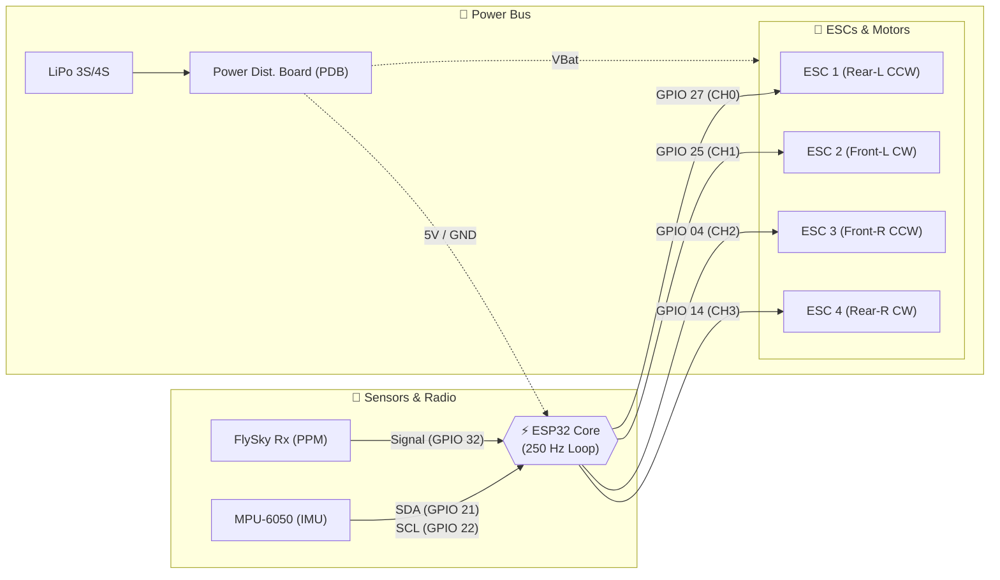

# 🛸 ESP32 Bare-Metal Flight Controller (F450 Platform)


-brightgreen?style=flat-square)


> 📦 **Firmware Source Code:** [`ESP32_Flight_Controller.ino`](./ESP32_Flight_Controller.ino)

<p align="center">
  
</p>

A lightweight, high-reliability custom flight controller firmware engineered from scratch in C/C++ for an F450 quadcopter. Bypassing bulky third-party flight stacks, this firmware operates directly on the ESP32 hardware timers to achieve deterministic 250 Hz real-time attitude estimation, multi-axis PID stabilization, and 16-bit hardware-level PWM motor actuation.

---

## 📐 System Architecture & Control Pipeline

The firmware operates on a non-blocking, microsecond-accurate deterministic loop:

```text
+-------------------------------------------------------------+
|                     250 Hz Master Loop                      |
|                                                             |
|  +-------------+       +-------------------+                |
|  |   MPU6050   | ----> |   Complementary   | ---> Roll/Pitch|
|  |  (400kHz)   |       |   Filter (α=0.98) |      Attitude  |
|  +-------------+       +-------------------+          |     |
|                                                       v     |
|  +-------------+       +-------------------+       +------+ |
|  | PPM Rx Dec. | ----> |   Decoupled PID   | ----> |Mixer | |
|  |  (Interrupt)|       |   Stabilization   |       +------+ |
|  +-------------+       +-------------------+          |     |
|                                                       v     |
|                                        +------------------+ |
|                                        | Hardware LEDC PWM| |
|                                        | (50Hz / 16-bit)  | |
|                                        +------------------+ |
+-------------------------------------------------------------+
```

---

## ⚡ Key Engineering Features

* **Deterministic 250 Hz Loop:** Precise `micros()` tracking ensures minimal timing jitter and exact numerical integration for attitude kinematics.
* **Sensor Fusion (Complementary Filter):** Blends high-frequency rate-gyro data with low-frequency accelerometer tilt over high-speed 400 kHz I2C ($α = 0.98$).
* **Angle PID Stabilization:**
  * **Proportional (P):** Fast dynamic response to angular displacement.
  * **Integral (I) with Anti-Windup:** Clamped on ground/low-throttle to eliminate spool-up tip-over.
  * **Derivative (D):** Direct angular rate dampening against oscillations.
* **Bare-Metal Motor Driving:** Direct ESP32 LEDC hardware timers (16-bit, 50 Hz base) producing clean ESC actuation without software timing overhead.
* **Failsafe & Arming Safety:**
  * Auto-disarm cut-off if roll/pitch exceeds 45 degrees.
  * Zero-throttle requirement for arming switch transition (CH5).

---

## 🔌 Hardware Configuration & Pinout

| Peripheral | Component / Signal | ESP32 Pin | Interface / Protocol |
| :--- | :--- | :--- | :--- |
| **IMU** | MPU-6050 SDA | `GPIO 21` | I2C (400 kHz Fast Mode) |
| **IMU** | MPU-6050 SCL | `GPIO 22` | I2C (400 kHz Fast Mode) |
| **Receiver** | PPM Signal Out | `GPIO 32` | Hardware Edge Interrupt |
| **Motor 1** | Rear Left (CCW) | `GPIO 27` | LEDC PWM (CH0) |
| **Motor 2** | Front Left (CW) | `GPIO 25` | LEDC PWM (CH1) |
| **Motor 3** | Front Right (CCW) | `GPIO 4` | LEDC PWM (CH2) |
| **Motor 4** | Rear Right (CW) | `GPIO 14` | LEDC PWM (CH3) |

### 📐 Wiring & Interconnection Diagram



## 🚀 Getting Started

1. Connect hardware according to the pinout table above.
2. Open `ESP32_Flight_Controller.ino` in Arduino IDE.
3. Ensure the ESP32 board package is installed.
4. Select **ESP32 Dev Module** under **Tools > Board**.
5. Keep the quadcopter stationary on a level surface during power-up for automatic IMU gyro calibration.
6. Arm via the designated transmitter switch (CH5) with throttle at minimum.
